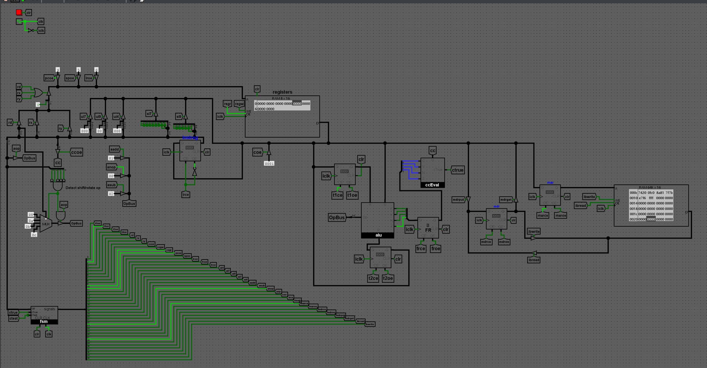

# gol-16

### Matteo Golin

# Overview

The gol-16 is a 16-bit processor inspired by the 32-bit ARM processor. It includes a custom assembly language with
full arithmetic operations, logical operations and conditional branching.

This project features a fully custom assembler written in C, which outputs binary files that can be directly uploaded to
the [Logisim Evolution][logisim-evolution] [schematic](schematic). The assembler includes its own test cases and test
evaluation with the `make check` recipe.

Alongside the assembler, the gol-16 features a [custom microcoding language](schematic/microcode.gmc): 'gmc' (gol-16
microcode). This microcode is 'assembled' by the fully custom [mcasm assembler](schematic/mcasm.c) into FSM decode ROM
and state ROM contents.

The schematic was created in [Logisim Evolution][logisim-evolution], a community extended version of [Logisim][logisim].
If you install [Logisim Evolution][logisim-evolution] on your machine, you will be able load assembled gol-16 programs
directly into the main memory ROM for execution by the built-in simulation.

This project is currently under construction.

## Index

Please visit each of the pages below to read about the gol-16 processor's specifications and view the code/project files
used to build it.

- [Specifications](spec)
- [Schematic](schematic)
- [Sample Programs](programs)
- [Assembler](assembler)
- [Emulator](emulator)

[logisim-evolution]: https://github.com/logisim-evolution/
[logisim]: https://github.com/logisim-evolution/
